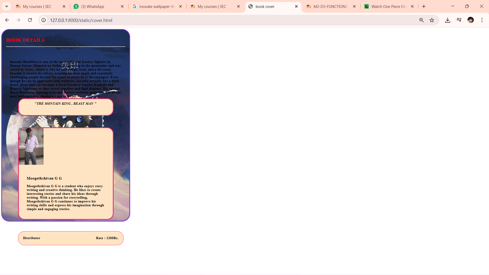

# Ex.05 Book Cover Page Design
## Date: 12/03/2026

## AIM:
To design a book back cover page using HTML and CSS.

## DESIGN STEPS:

### Step 1:
Create a Django Admin project.

### Step 2:
Create an app in the Django interface.

### Step 3:
Create a folder named 'static' in the app folder.

### Step 4:
Create a new HTML file in the static folder.

### Step 5:
Write the HTML code with relevant CSS properties.

### Step 6:
Choose the appropriate style and color scheme.

### Step 7:
Insert the images in their appropriate places.

### Step 8:
Publish the website in the LocalHost.

## PROGRAM:
```
HTML


<html>
<head>
    <title >book cover</title>
    <link href="style.css" rel="stylesheet">

</head>
<body>
    <div class="border">

        <div class="heading">
            <h1>BOOK DETAILS</h1>
        <div line="lines">
            <hr>
        </div>

        </div>
        <div class="paragraph">
            <p1>Inosuke Hashibira is one of the most wild and fearless fighters in Demon Slayer: Kimetsu no Yaiba. He grew up in the mountains and was raised by boars, which is why he acts rough, loud, and a bit crazy. Inosuke is known for always wearing his boar mask and constantly challenging people because he wants to prove he is the strongest.

Even though he can be aggressive and stubborn, Inosuke actually has a kind heart. Over time, he becomes a loyal friend to Tanjiro Kamado and Zenitsu Agatsuma as they travel together and fight demons. His special Beast Breathing fighting style and fearless attitude make him one of the most unforgettable characters in the series.
        <div class="border2">
            <div class="quote">
                <p1>"THE MONTAIN KING , BEAST MAN "</p1>
            </div>
        </div>
        <br>
        <br>
        <br>

        <div class="border3">
            <div class="img">
                
            </div>
            <div class="personal">
                <h3 color="red">Moogethshivan G G</h3>
                <p2>
                    Moogethshivan G G is a student who enjoys story writing and creative thinking. He likes to create interesting stories and share his ideas through writing.

With a passion for storytelling, Moogethshivan G G continues to improve his writing skills and express his imagination through simple and engaging stories.

                </p2>
            </div>
        </div>
        <br>
        <br>
        <br>


        <div class="box">
            <span class="Distributer">Distributer</span>
            <span class="Rate">Rate : 1200Rs.</span>
        </div>

        
</body>
</html>

CSS

.border
{
    background-image: url("ino.jpg");
    border-style: solid;
    border-color: rgb(43, 226, 55);
    width: 800px;
    height: 1400px;
    border-radius: 50px;
}
.heading
{
    padding: 25px;
    text-align: left;
    color: red;
}
.paragraph
{
    font-size: 20px;
    letter-spacing: 1.2;
    top: 100px;
    padding: 50px;
    font-weight: bold;
}
.border2
{
    background-color: rgb(9, 112, 114);
    border-style: solid;
    border-color:rgb(13, 173, 58);
    margin-inline-start: 50px;    
    margin-inline-end: 50px;
    line-height: 3;
    height: 100px;
    border-radius: 40px;
}
.quote
{
    letter-spacing: 1.2;
    text-align: left;
    font-size: 20px;
    padding-left: 100px;
    font-style: italic;
    font-weight: bold;
}
.border3
{
    background-color: rgb(15, 130, 145);
    border-style: solid;
    border-color: rgb(20, 163, 49);
    margin-inline-start: 50px;
    margin-inline-end: 50px;
    border-radius: 40px;
}
.personal
{
    letter-spacing: 1.2;
    top: 50px;
    padding: 50px;
    font-weight: bold;  
    font-size: 20;    
}
.border4
{
    background-color: rgb(27, 149, 210);
    border-style: solid;
    border-color: rgb(8, 165, 53);
    margin-inline-start: 50px;
    margin-inline-end: 50px;
    border-radius: 40px;
}
.box
{
    margin-inline-start: 50px;
    margin-inline-end: 50px;

    width: 600px;
    padding: 30px;
    background-color:rgb(7, 97, 95);
    border: 5px solid #17e933;
    border-radius: 20px;
    
    display: flex;
    justify-content: space-between;
    align-items: center;
}

.publisher
{
    letter-spacing: 1.2;
    font-weight: bold;
    font-size: 20;
}

.price
{
    letter-spacing: 1.2;
    font-weight: bold;
    font-size: 20;

}
```

## OUTPUT:


## RESULT:
The program for designing book back cover page using HTML and CSS is completed successfully.
